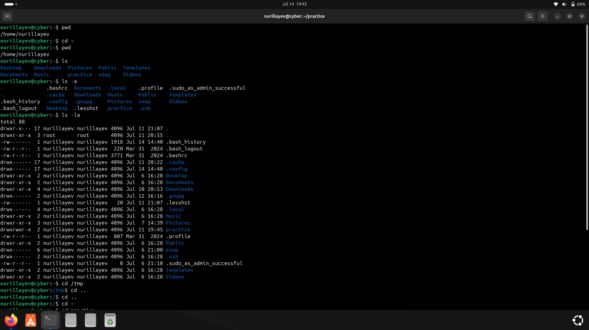
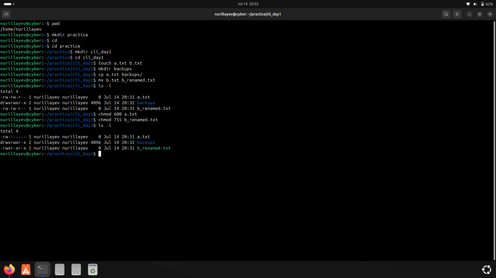
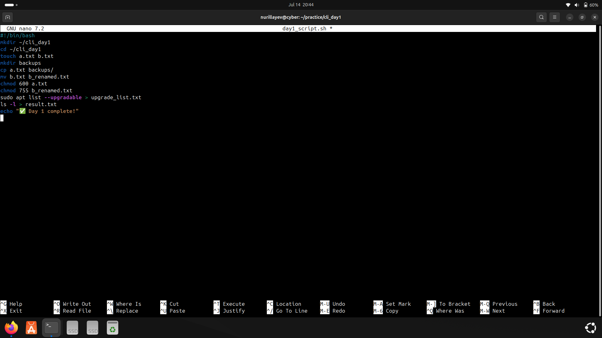
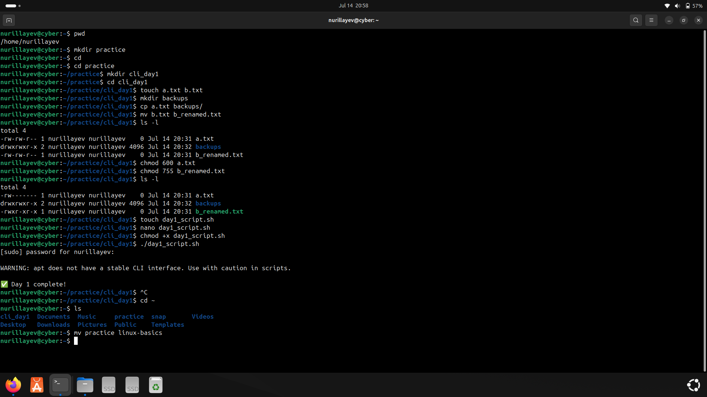
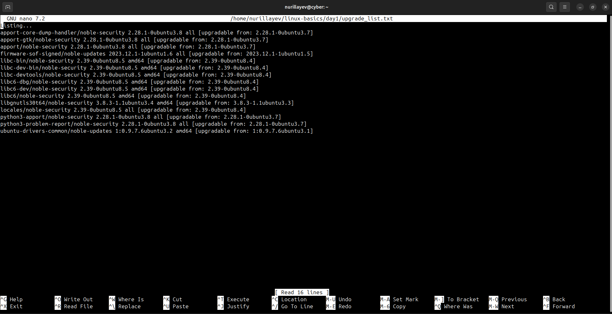

# Day 1 – Basic Terminal Commands & Permissions

### 🧭 Objective

The goal of Day 1 was to gain practical experience with essential Linux terminal commands related to file management, directory operations, and basic permission handling. 

---

### 📚 Commands Used

- File & folder creation: `touch`, `mkdir`
- File renaming: `mv`
- Permission settings: `chmod`
- Package information: `apt list --upgradable`
- Privileged execution: `sudo`

---

### ⚙️ Practical Tasks

- Created a text file: `a.txt`
- Created a folder: `backups/`
- Renamed a file from `b.txt` to `b_renamed.txt`
- Wrote a shell script: `day1_script.sh` to automate these tasks
- Checked system package updates using `apt list --upgradable`
- Saved upgradable package list to `upgrade_list.txt`

---

### 🛠️ Script

- [`day1_script.sh`](./day1_script.sh): Automates basic file and directory operations.

---

### 📄 Output Files

- [`upgrade_list.txt`](./upgrade_list.txt): Shows list of available system updates.

---

### 📸 Screenshots

#### 1. Basic navigation and file listing
Includes commands like `pwd`, `cd ..`, `cd ~`, and `ls`

#### 2. File operations and permissions
Shows usage of `chmod`, `mv`, and `cp`

#### 3. Script execution
Displays the output of running `day1_script.sh`

#### 4. Directory creation and automation
Demonstrates `mkdir`, file moves, permission changes

#### 5. Upgrade list result
Shows output of `apt list --upgradable` displaying available package updates

---

### ✅ Status

All Day 1 tasks were completed successfully. Files, directories  and permissions were handled manually and through scripting.
