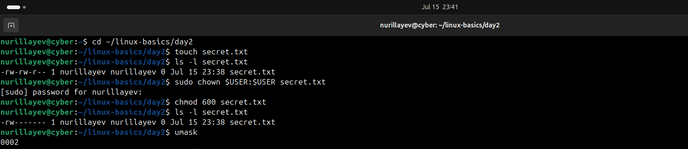
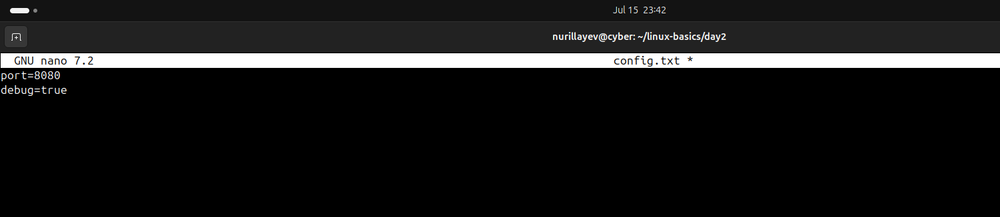
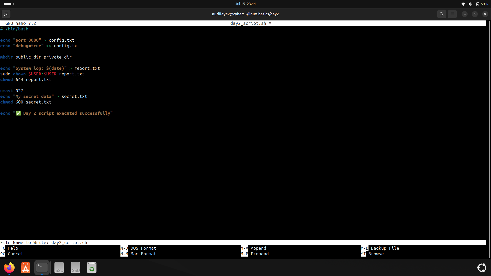
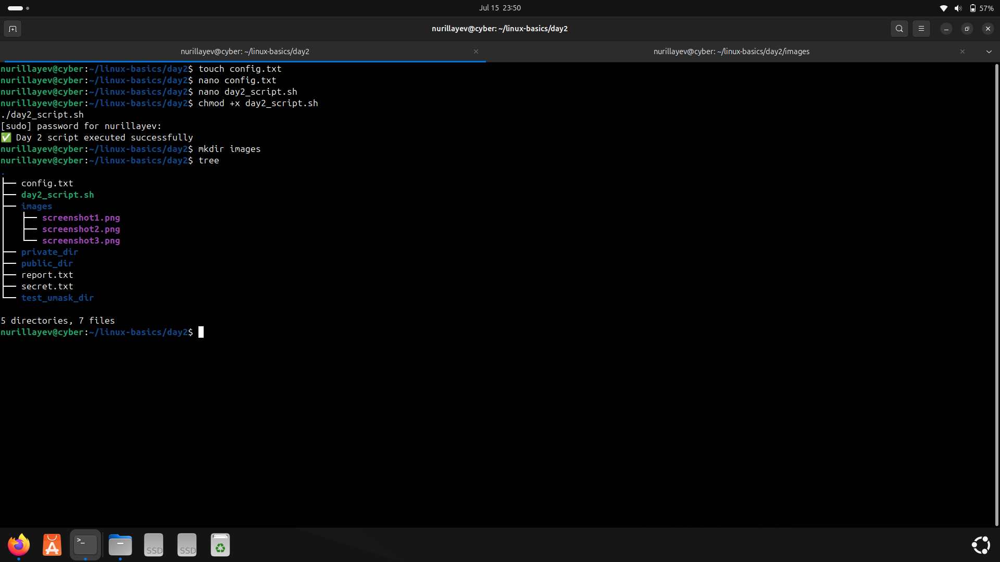

# Day 2 – Files, Permissions & nano Editor

### 🧭 Objective

The goal of Day 2 was to gain practical experience managing files and directories, setting proper permissions, working with ownership, understanding `umask`, and editing configuration files using the `nano` editor.

---

### 📚 Commands Used

- File & folder creation: `touch`, `mkdir`
- Permission handling: `chmod`, `umask`
- Ownership change: `chown`
- File editing: `nano`, `echo`
- Directory structure visualization: `tree`
- Disk usage check: `du -sh`
- Script automation: `bash`, `chmod +x`

---

### ⚙️ Practical Tasks

- Created files: `config.txt`, `secret.txt`, `report.txt`
- Created folders: `public_dir/`, `private_dir/`
- Set file and directory permissions using `chmod`
- Changed file ownership using `sudo chown`
- Verified default permission mask via `umask`
- Added configuration text to `config.txt` using `nano`
- Installed and used `tree` to view folder structure
- Wrote and executed shell script: `day2_script.sh`

---

### 🛠️ Script

- [`day2_script.sh`](./day2_script.sh): Automates file creation, permission setup, and structure display.

---

### 📄 Output Files

- `config.txt`: Configuration file containing port and server info  
- `secret.txt`, `report.txt`: Sample data files with restricted permissions  
- `public_dir/`, `private_dir/`: Sample directories with different access levels

---

### 📸 Screenshots

#### 1. File creation, permissions, ownership, and umask  
Includes `touch`, `ls -l`, `chmod`, `sudo chown`, and `umask` usage  

#### 2. Editing config.txt in nano  
Shows `nano` used to write `port=8080` and `server_name=localhost`  

#### 3. Installing and using tree command  
Displays installation of `tree` and resulting directory structure  

#### 4. Script automation  
Shows execution of `day2_script.sh` and automated outputs  

---

### ✅ Status

All Day 2 tasks were successfully completed and documented with commands, results, and screenshots.
