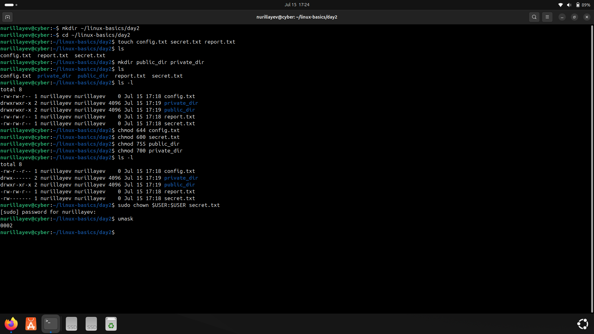
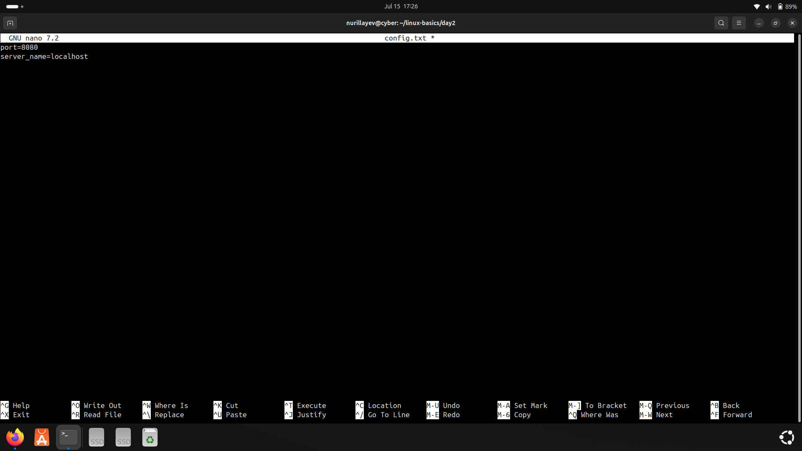
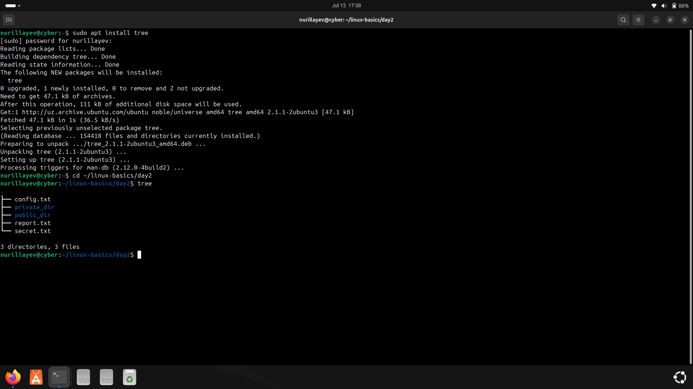
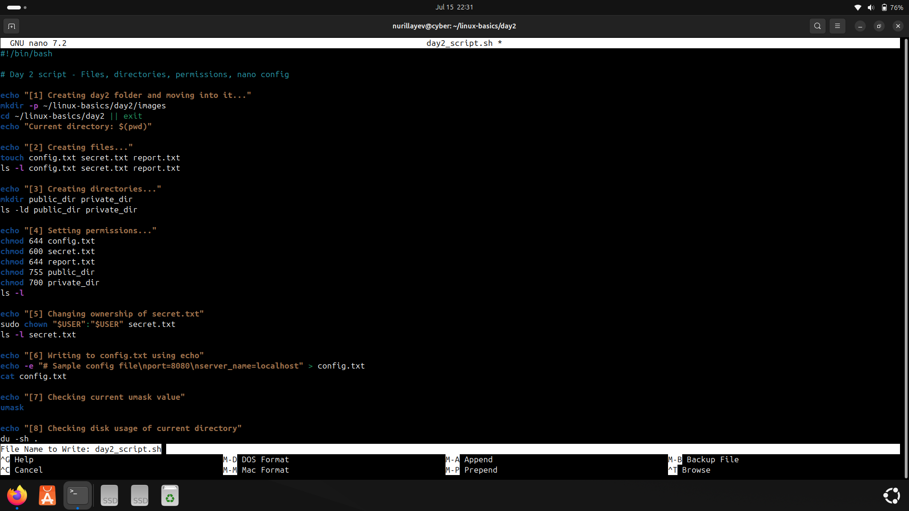

# Day 2 – Permissions, Editors, and Automation

### 🧭 Objective

The goal of Day 2 was to practice permission management using `chmod`, `chown`, and `umask`, as well as edit configuration files using `nano`, and automate tasks via a custom shell script.

---

### 📚 Commands Used

- File creation & inspection: `touch`, `ls -l`
- Ownership and permission: `sudo chown`, `chmod`, `umask`
- File editing: `nano`
- Directory tree view: `tree`
- Script creation and execution: `bash`, `chmod +x`

---

### ⚙️ Practical Tasks

- Created a file `secret.txt` and inspected its permissions
- Applied ownership changes with `sudo chown`
- Updated file permissions using `chmod`
- Configured default permission behavior using `umask`
- Created and edited `config.txt` using `nano`
- Installed and used `tree` to view directory structure
- Wrote and executed `day2_script.sh` to automate key operations

---

### 🛠️ Script

- [`day2_script.sh`](./day2_script.sh): Automates creation of config files, directories, and file permission management.

---

### 📸 Screenshots

#### 1. File creation and permission settings  
Commands used: `touch`, `ls -l`, `sudo chown`, `chmod`, `umask`

#### 2. Editing configuration file using nano  
Config file with values such as `port=8080`, `debug=true`

#### 3. Script execution  
Shell script to automate file and permission tasks

#### 4. Directory structure with tree  
Visual layout of files and directories using `tree`

---

### ✅ Status

All Day 2 objectives were completed successfully with relevant scripts, configuration, and permission handling tasks.
