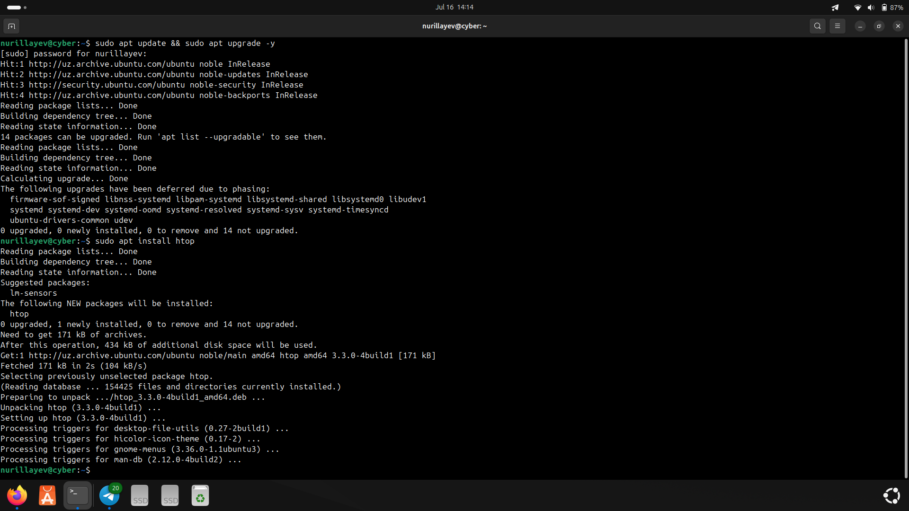
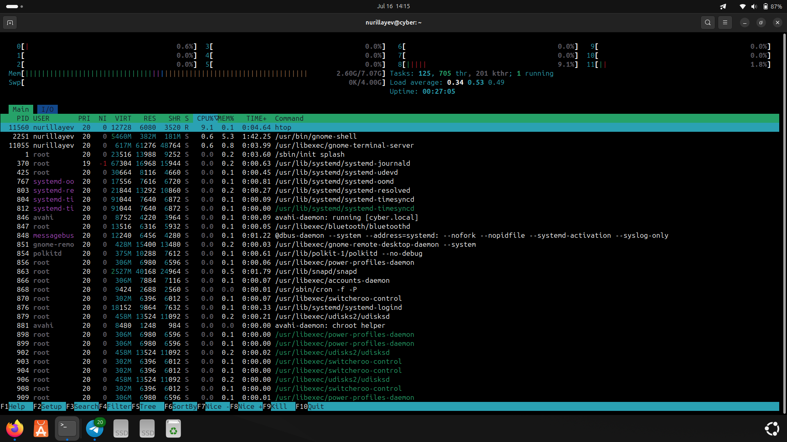
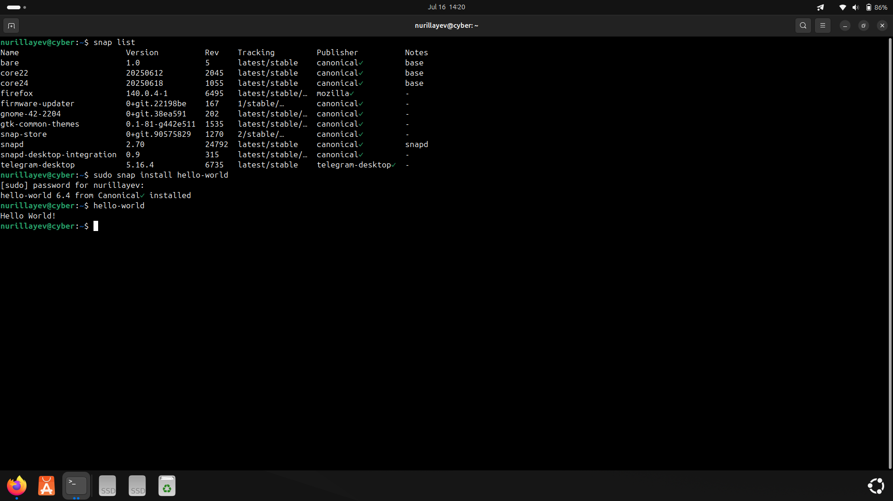
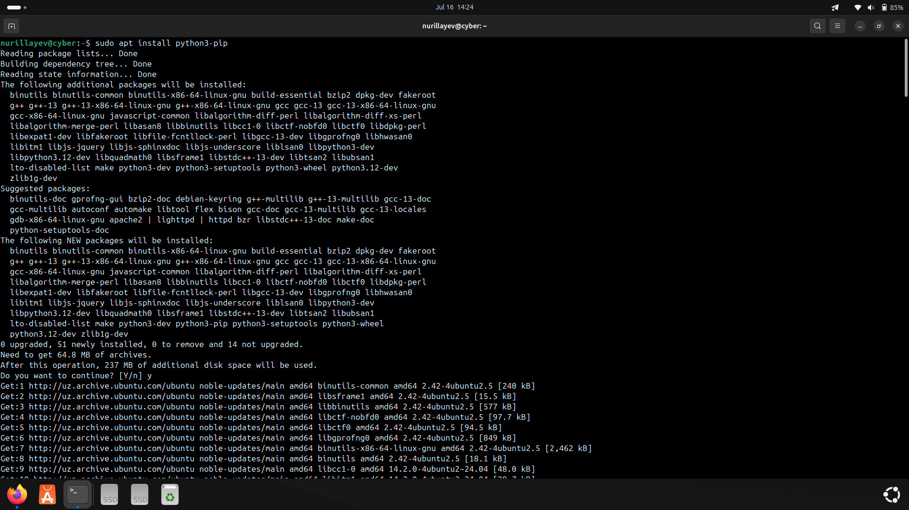
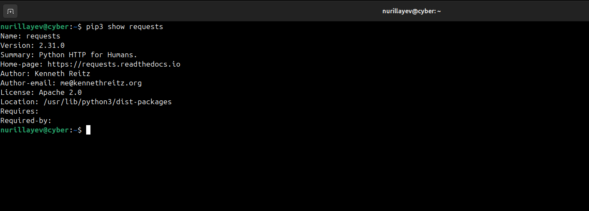
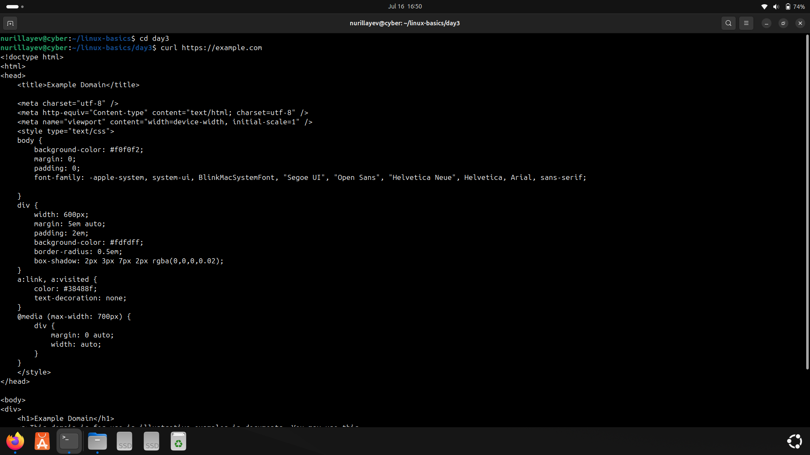
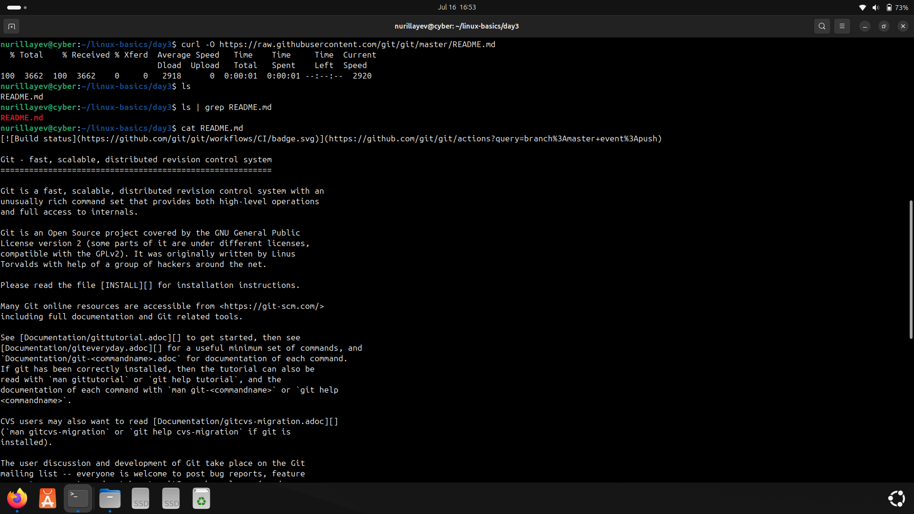
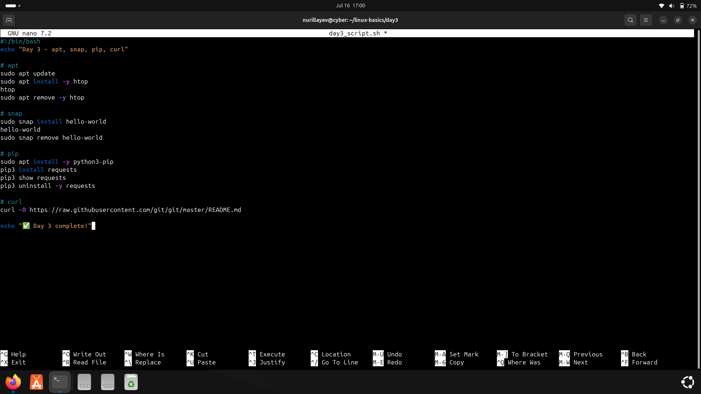

# Day 3 – Package Management: apt, snap, pip3, curl

### 🧭 Objective

The goal of Day 3 was to practice using different package management tools on Ubuntu, including apt for system packages, snap for containerized packages, pip3 for Python packages, and curl for downloading files from the internet.

---

### 📚 Commands Used

- Package management: `apt`, `snap`, `pip3`
- File downloading: `curl`
- Output filtering: `grep`

---

### ⚙️ Practical Tasks

- Updated the system package index using `apt update`
- Installed and tested the `htop` system monitor
- Installed and ran the `hello-world` snap application
- Checked installed snaps with `snap list`
- Verified the `requests` Python package using `pip3 show`
- Downloaded a file from GitHub using `curl`
- Verified download result using `ls | grep`
- Wrote and executed a shell script automating these tasks

---

### 🛠️ Script

- [`day3_script.sh`](./day3_script.sh): Contains all steps covered during Day 3.

---

### 📸 Screenshots

#### 1. Installing and using `htop` with apt
- `apt update`, `apt install htop`, and running `htop`

#### 2. Working with Snap packages
- Installed and verified `hello-world`
- Listed installed snaps

#### 3. pip3 and Python packages
- Installed pip3, checked `requests` package

#### 4. Downloading files using curl
- `curl https://example.com`
- `curl -O https://raw.githubusercontent.com/git/git/master/README.md`

#### 5. Script creation and execution
- Created and edited `day3_script.sh` with nano

---

### ✅ Status

All tasks were completed successfully and documented.
