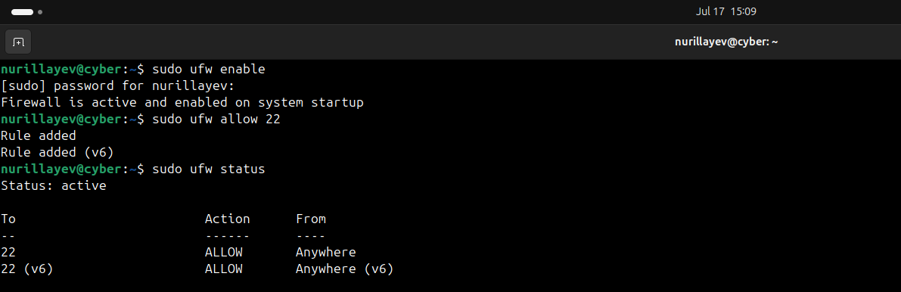
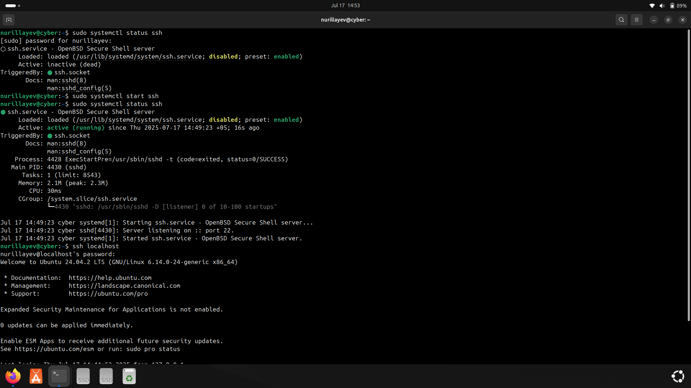

# Day 4 – User Management, UFW, and SSH Access

### 🧭 Objective

The goal of Day 4 was to learn how to create and manage local users, configure UFW firewall, enable SSH server, and access the system remotely from a mobile device using Termux.

---

### 📚 Commands Used

- User management: `adduser`, `usermod`, `deluser`
- Firewall configuration: `ufw`
- SSH setup and usage: `openssh-server`, `ssh`, `hostname -I`, `ip a`
- User monitoring: `who`
- Termux SSH client: `pkg`, `ssh`
- Script editing: `nano`

---

### ⚙️ Practical Tasks

- Created a new local user and added it to the `sudo` group
- Deleted the created user using `deluser`
- Enabled UFW and allowed port 22 for SSH access
- Installed `openssh-server` and verified SSH service status
- Connected via SSH to `localhost`
- Retrieved the system's IP address using `ip a` and `hostname -I`
- Monitored logged-in users using the `who` command
- Connected to the same system from a mobile device via Termux using IP address
- Verified access using commands like `whoami`, `pwd`, and `uptime`
- Created a script file using `nano` editor

---

### 🛠️ Script

- [`day4_script.sh`](./day4_script.sh): Contains all commands executed during Day 4.

---

### 📸 Screenshots

#### 1. User management and SSH server setup
- Added/deleted user, checked SSH service status, and tested local SSH connection  

#### 2. UFW configuration and IP address lookup
- Enabled UFW and allowed port 22  
- Found IP address using `ip a` and `hostname -I`  

#### 3. Monitoring users and remote access setup
- Used `who` to check logged-in users  
- Verified that two devices were connected simultaneously  

#### 4. Script creation
- Wrote and saved `day4_script.sh` using `nano`  

#### 5. Mobile SSH connection from Termux
- Connected via Termux using `ssh username@ip`  
- Ran verification commands (`whoami`, `pwd`, etc.)  

---

### ✅ Status

All Day 4 tasks were successfully completed.
