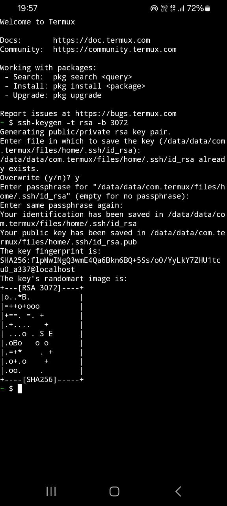

# Day 5 – SSH Key Authentication and Remote User Setup

### 🧭 Objective

The goal of Day 5 was to enhance remote access security by configuring SSH key-based authentication, creating a new user and accessing the system from a mobile device via Termux without a password prompt.

---

### 📚 Commands Used

- User creation: `adduser`, `mkdir`, `chown`, `chmod`
- SSH key authentication: `ssh-keygen`, `authorized_keys`
- SSH connection: `ssh`, `cat`, `nano`
- User switching: `su - devops`
- File permissions: `chmod 700`, `chmod 600`

---

### ⚙️ Practical Tasks

- Created a new user named `devops` for secure remote login
- Set up SSH directory and permissions for `devops`
- Switched to the `devops` user using `su - devops`
- Generated SSH key pair on Termux (`id_rsa` and `id_rsa.pub`)
- Retrieved public key from Termux using `cat`
- Copied the public key into `/home/devops/.ssh/authorized_keys` on the Ubuntu system
- Verified that passwordless SSH login worked from Termux
- Wrote a shell script documenting the above steps

---

### 🛠️ Script

- [`day5_script.sh`](./day5_script.sh): Contains all executed commands and steps for setting up SSH key-based login.

---

### 📸 Screenshots

#### 1. SSH directory setup for `devops` user
- Created `.ssh` folder and configured ownership and permissions  

#### 2. Public key added to `authorized_keys`  
- Used `nano` to paste Termux-generated public key  

#### 3. Full script written for Day 5 activities  

#### 4. SSH key generation on Termux  
- Command: `ssh-keygen -t rsa -b 3072`  

#### 5. Termux public key content displayed  
- Command: `cat ~/.ssh/id_rsa.pub`  

---

### ✅ Status

All Day 5 tasks were successfully completed. 
