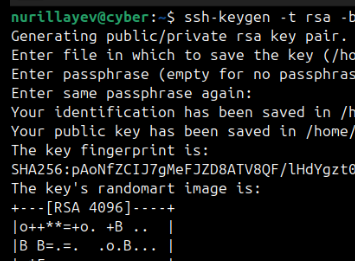
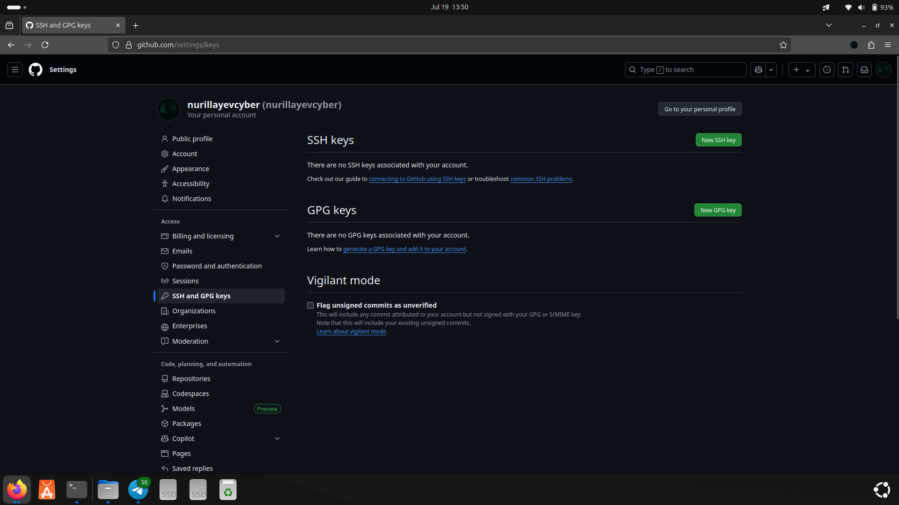
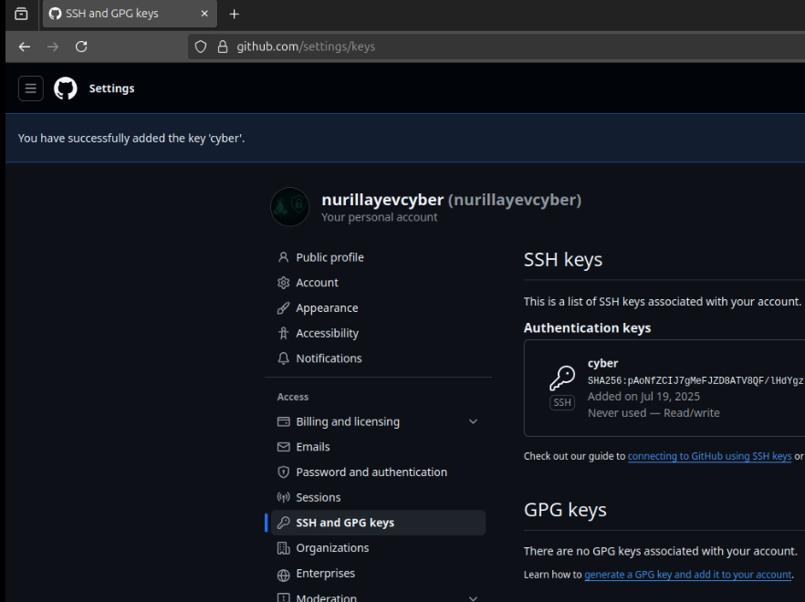
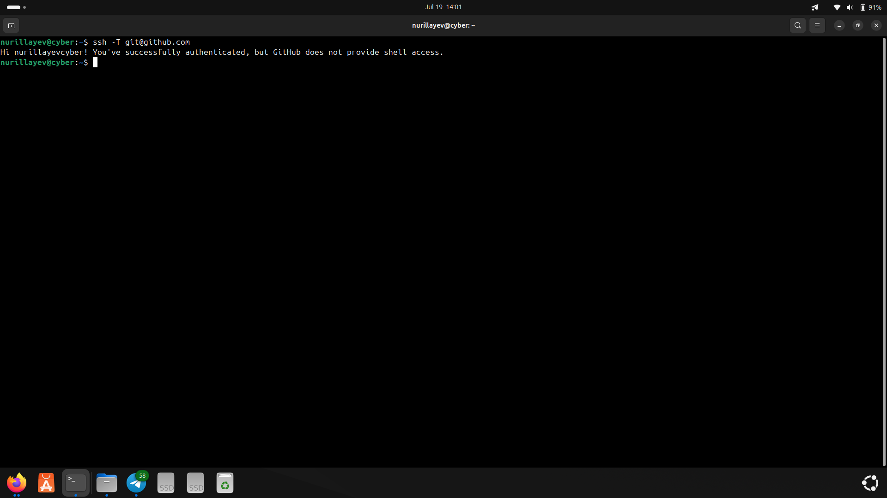
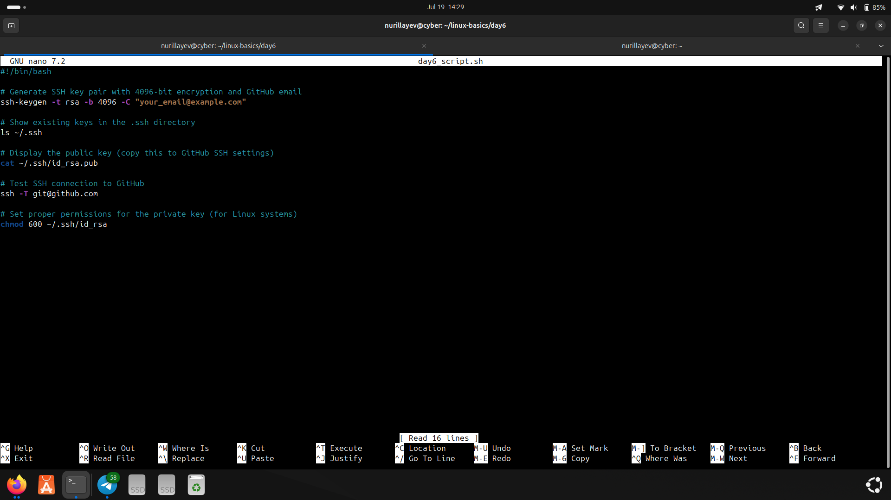

# Day 6 – GitHub SSH Authentication Setup

### 🧭 Objective

The goal of Day 6 was to configure SSH authentication for GitHub in order to securely push and pull repositories without using a username and password.

---

### 📚 Commands Used

- SSH key generation: `ssh-keygen -t rsa -b 4096 -C "your_email@example.com"`
- Public key display: `cat ~/.ssh/id_rsa.pub`
- SSH testing: `ssh -T git@github.com`
- File permissions: `chmod 600 ~/.ssh/id_rsa`
- SSH directory listing: `ls ~/.ssh`
- Script creation: `nano`

---

### ⚙️ Practical Tasks

- Created a 4096-bit RSA SSH key pair linked to a GitHub account
- Verified presence of SSH files in the `.ssh` directory
- Copied and added the public key to GitHub via "SSH and GPG keys" settings
- Confirmed that the key was successfully added
- Tested SSH connection to GitHub to confirm authentication
- Modified file permissions to secure the private key
- Wrote all commands to a script file using the `nano` editor

---

### 🛠️ Script

- [`day6_script.sh`](./day6_script.sh): Contains all commands executed during Day 6.

---

### 📸 Screenshots

#### 1. SSH key generation
- Command used: `ssh-keygen -t rsa -b 4096 -C "your_email@example.com"`  

#### 2. GitHub SSH key settings page
- Added the new public key under GitHub → Settings → SSH and GPG keys  

#### 3. Confirmation of key addition
- GitHub confirmed that the SSH key was added successfully  

#### 4. SSH authentication test
- Command used: `ssh -T git@github.com`  
- GitHub responded with "Hi username! You've successfully authenticated..."  

#### 5. Script file creation
- Commands were written and saved in `day6_script.sh` using `nano`  

---

### ✅ Status

All Day 6 tasks were completed successfully. SSH authentication with GitHub is now working.
