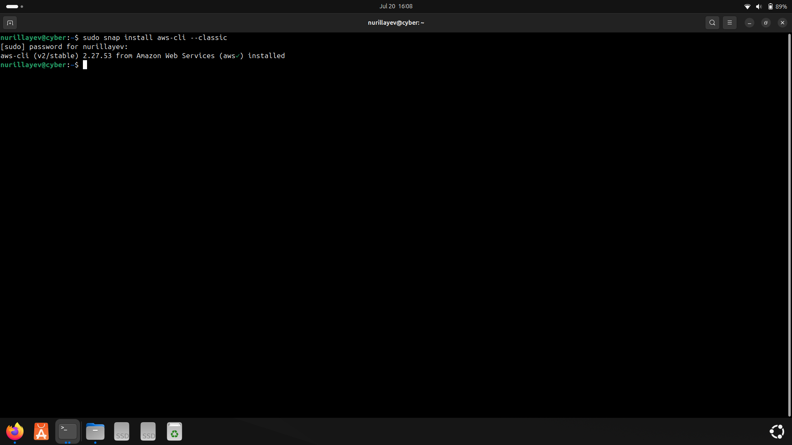
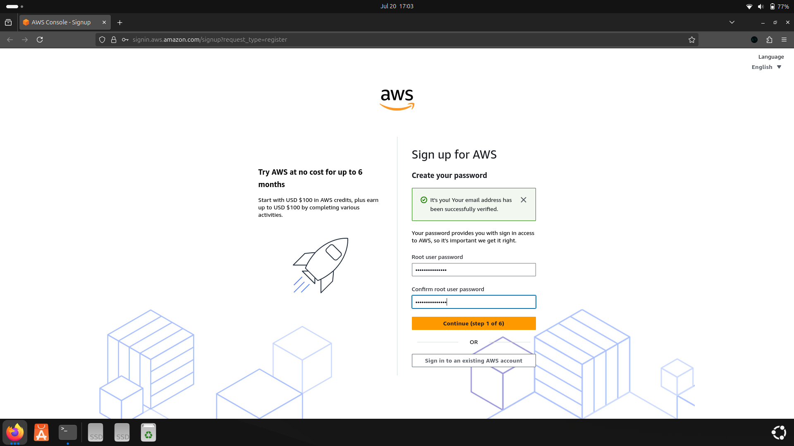
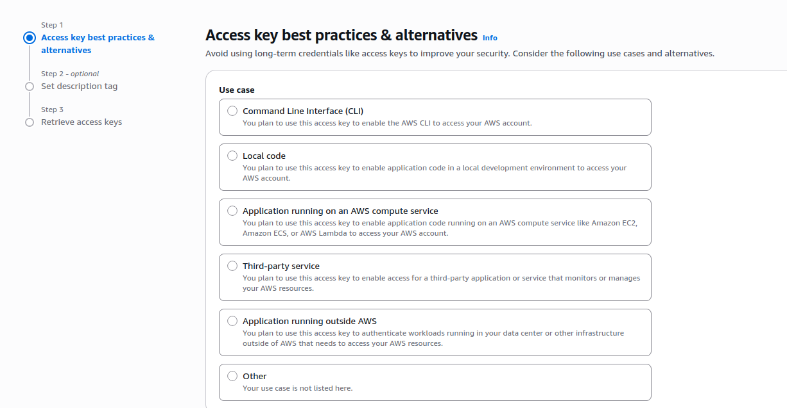
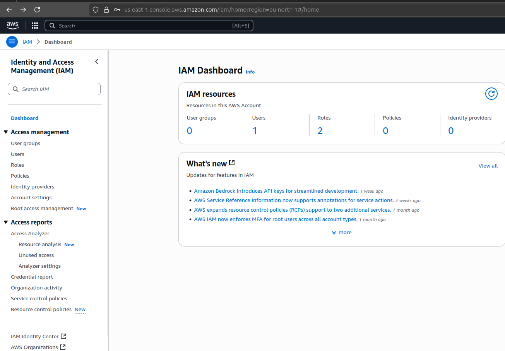
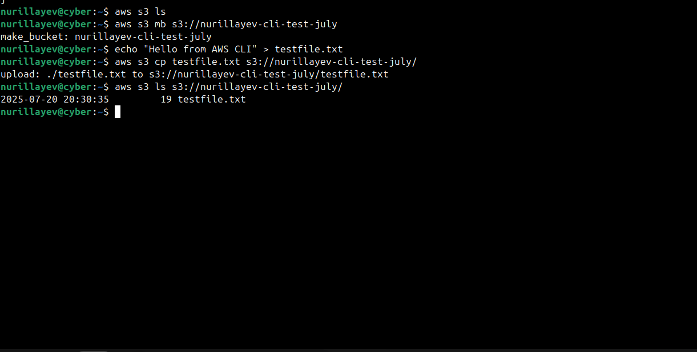
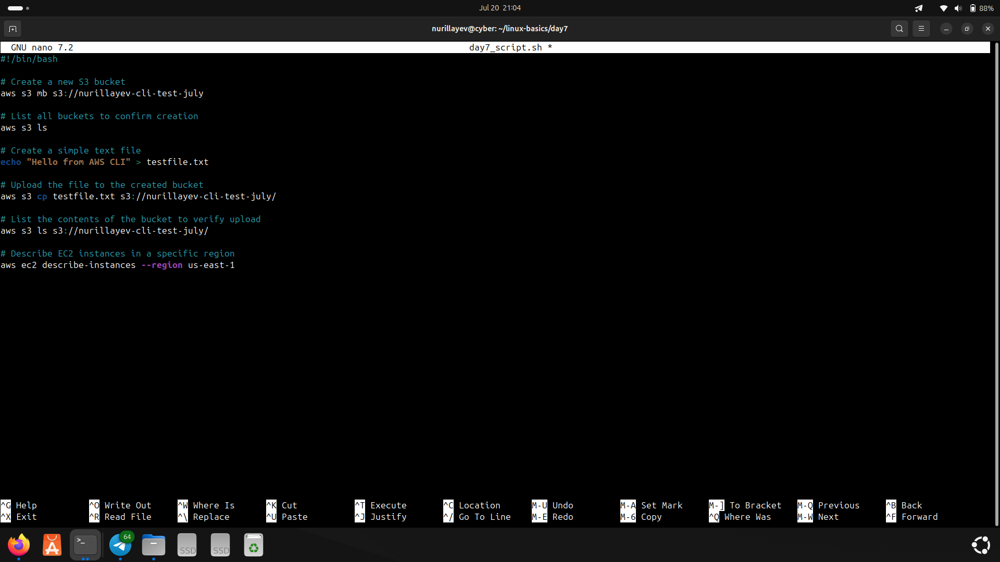

# Day 7 – AWS CLI S3 Bucket Creation 

### 🧭 Objective

The goal of Day 7 was to practice using AWS CLI to interact with Amazon S3 (bucket creation and basic file operations)  

---

### 📚 Commands Used

#### 🔸 AWS CLI

- Configure AWS credentials: `aws configure`
- Create S3 bucket: `aws s3 mb s3://nurillayev-cli-test-july`
- List buckets: `aws s3 ls`

### ⚙️ Practical Tasks

- Configured AWS credentials via `aws configure`
- Created a new S3 bucket using AWS CLI
- Verified bucket creation with `aws s3 ls`
- Practiced uploading simple files to the S3 bucket

### 🛠️ Script

- [`day7_script.sh`](./day7_script.sh): Contains  AWS CLI commands used for today’s session.

---

### 📸 Screenshots

#### 1. AWS CLI installation
- Command: sudo snap install aws-cli --classic  

#### 2. AWS Account registration – Password creation step  

#### 3. Access key best practices & alternatives  

#### 4. IAM Dashboard view  

#### 5. S3 bucket creation and file upload (CLI) 

#### 6. Bash Script creation using nano

---

### ✅ Status

 Day 7 tasks were successfully completed.
