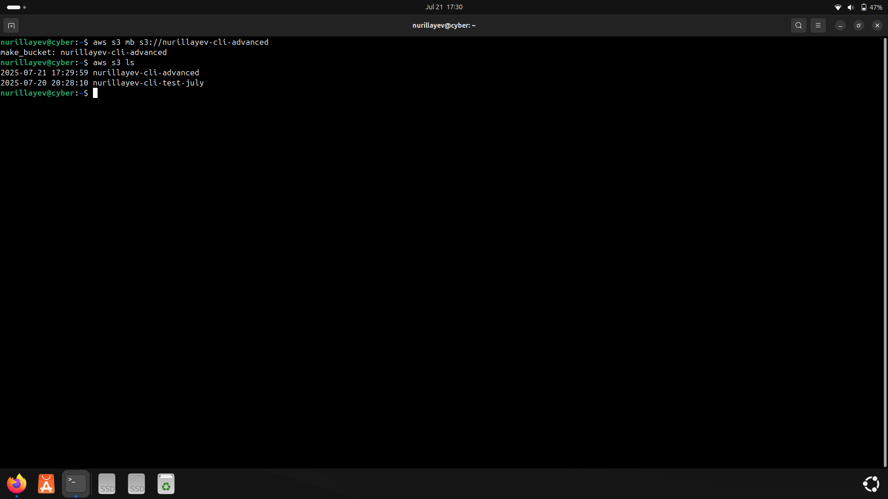
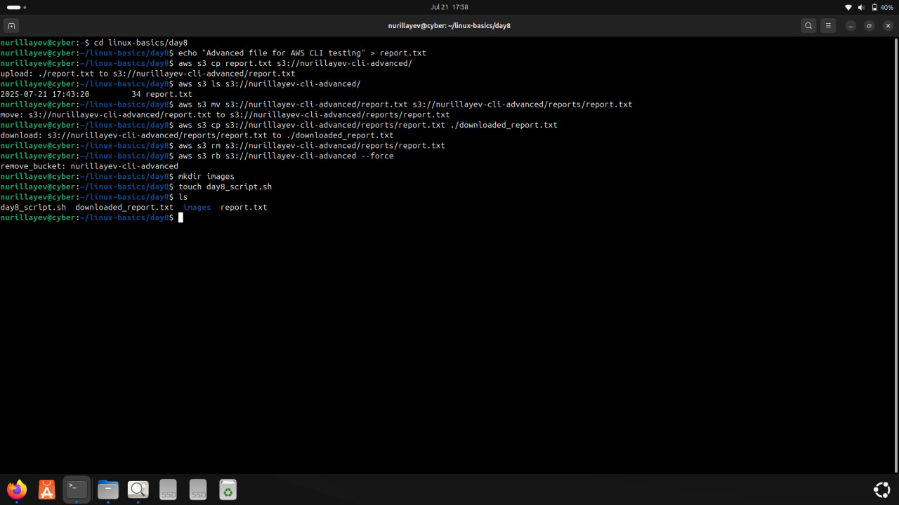
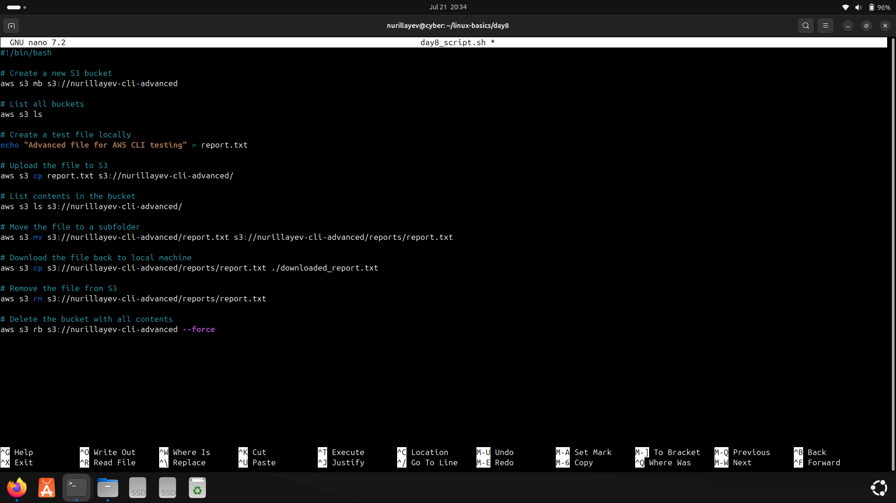

# Day 8 – AWS CLI Advanced File Operations

### 🧭 Objective

The goal of Day 8 was to practice advanced AWS CLI commands to manage files within an S3 bucket — including uploading, moving, downloading, and deleting objects — and to securely remove the entire bucket after operations.

---

### 📚 Commands Used

- `aws s3 mb` – Create a new bucket
- `aws s3 cp` – Copy files to/from S3
- `aws s3 ls` – List contents of a bucket
- `aws s3 mv` – Move/rename files in a bucket
- `aws s3 rm` – Delete files from a bucket
- `aws s3 rb --force` – Remove a bucket with contents

---

### ⚙️ Practical Tasks

- Created a bucket named `nurillayev-cli-advanced`
- Uploaded a text file (`report.txt`) to the bucket
- Moved the file into a subfolder `reports/` within the bucket
- Downloaded the file back to the local system
- Deleted the file from the bucket
- Removed the bucket and all of its contents using `--force`

---

### 🛠️ Script

- [`day8_script.sh`](./day8_script.sh): Contains all AWS CLI commands executed during Day 8.

---

### 📸 Screenshots

#### 1. Creating the bucket
- Command: `aws s3 mb s3://nurillayev-cli-advanced`  

#### 2. Uploading,moving,removing a file
- Command: `aws s3 cp report.txt s3://nurillayev-cli-advanced/`  
- Command: `aws s3 mv ...`  
- Commands: `aws s3 rm`, `aws s3 rb --force`

#### 3. Script file creation
- Commands were written and saved in `day8_script.sh` using `nano`  

---

### ✅ Status

All advanced AWS S3 tasks were completed via CLI.

