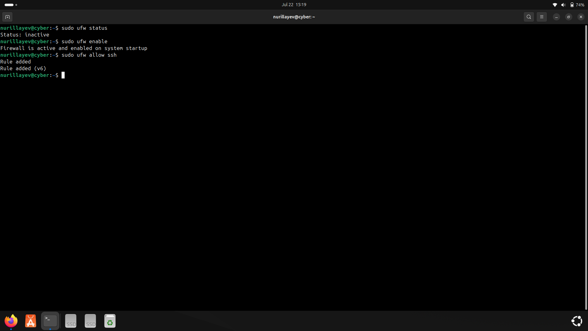
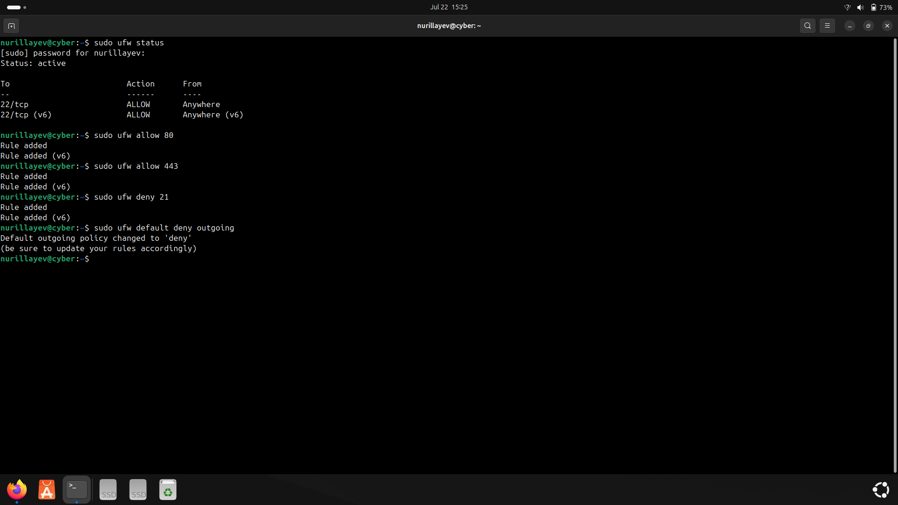
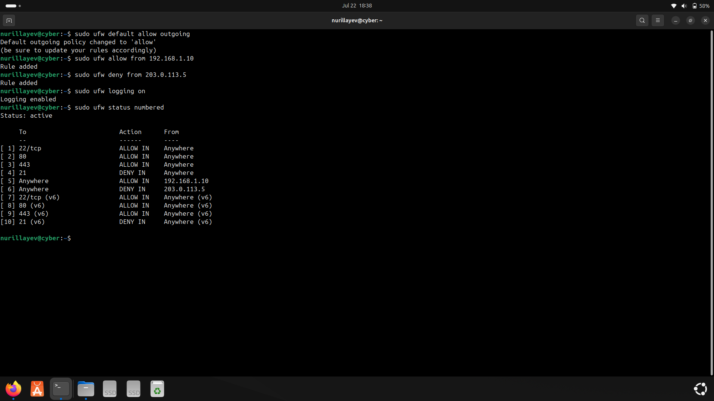
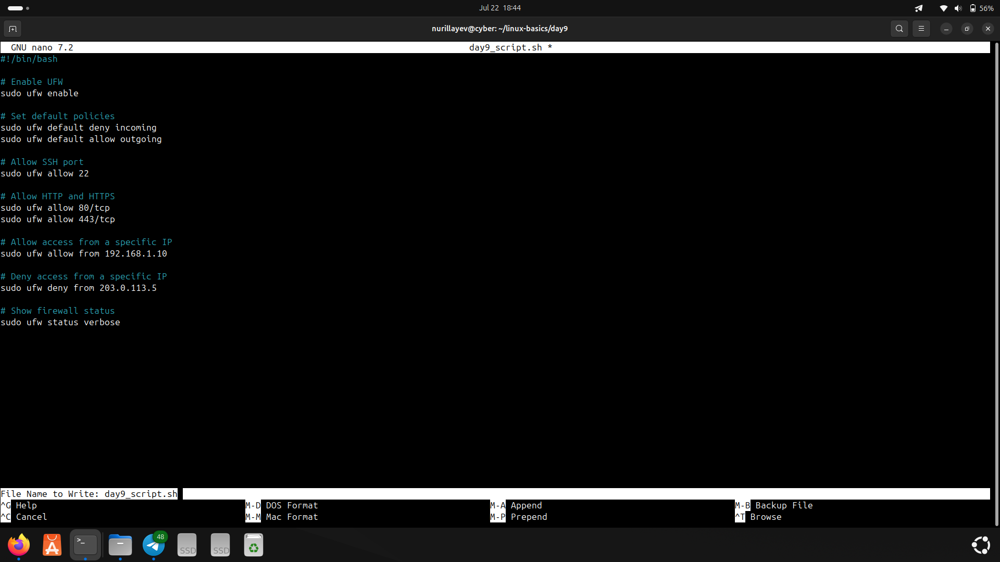

# Day 9 – UFW Firewall Configuration and Rules

### 🧭 Objective

The goal of Day 9 was to configure and manage the UFW (Uncomplicated Firewall).

---

### 📚 Commands Used

- `sudo ufw status` – View current firewall status  
- `sudo ufw enable` – Enable the firewall  
- `sudo ufw allow <port>` – Allow traffic on a specific port  
- `sudo ufw deny <port>` – Block traffic on a specific port  
- `sudo ufw default deny outgoing` – Deny all outgoing connections by default  
- `sudo ufw default allow outgoing` – Allow all outgoing connections by default  
- `sudo ufw allow from <IP>` – Allow traffic from a specific IP address  
- `sudo ufw deny from <IP>` – Deny traffic from a specific IP address  
- `sudo ufw logging on` – Enable logging  
- `sudo ufw status numbered` – Show numbered rules in active firewall  

---

### ⚙️ Practical Tasks

- Enabled the firewall using `ufw enable`  
- Allowed traffic on ports 22 (SSH), 80 (HTTP), and 443 (HTTPS)  
- Denied traffic on port 21 (FTP)  
- Set the default outgoing policy to `deny`, then reverted it to `allow`  
- Enabled firewall logging  
- Verified all rules using `ufw status numbered`  

---

### 🛠️ Script

- [`day9_script.sh`](./day9_script.sh): Contains all UFW commands executed during Day 9.

---

### 📸 Screenshots

#### 1. Enabling UFW and allowing SSH
- Commands: `ufw enable`, `ufw allow ssh`  

#### 2. Allowing/blocking ports and setting default deny
- Commands: `ufw allow 80`, `ufw allow 443`, `ufw deny 21`, `ufw default deny outgoing`  

#### 3. Allow/deny by IP, revert outgoing policy, and logging
- Commands: `ufw default allow outgoing`, `ufw allow from 192.168.1.10`, `ufw deny from 203.0.113.5`, `ufw logging on`, `ufw status numbered`  

#### 4. Script creation
- UFW configuration written and saved in `day9_script.sh` using `nano`  

---

### ✅ Status

All Day 9 firewall configuration tasks were successfully completed.
