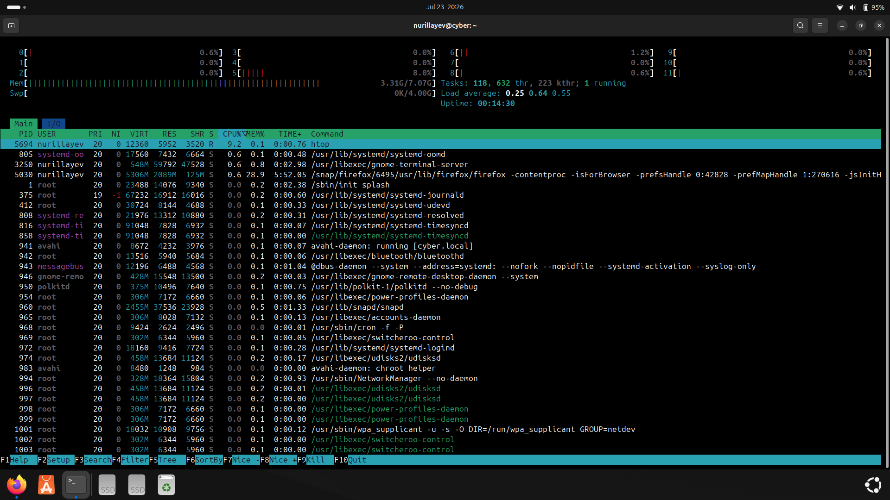
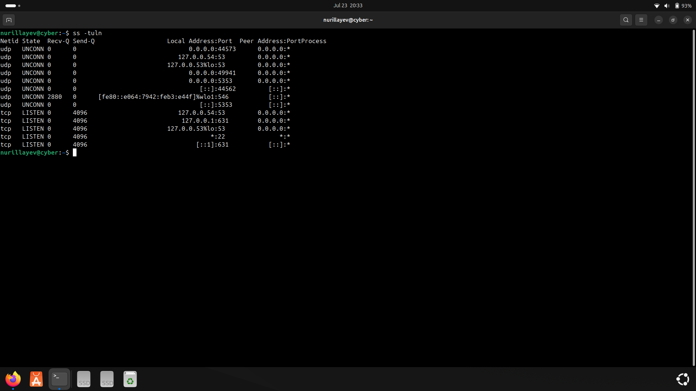
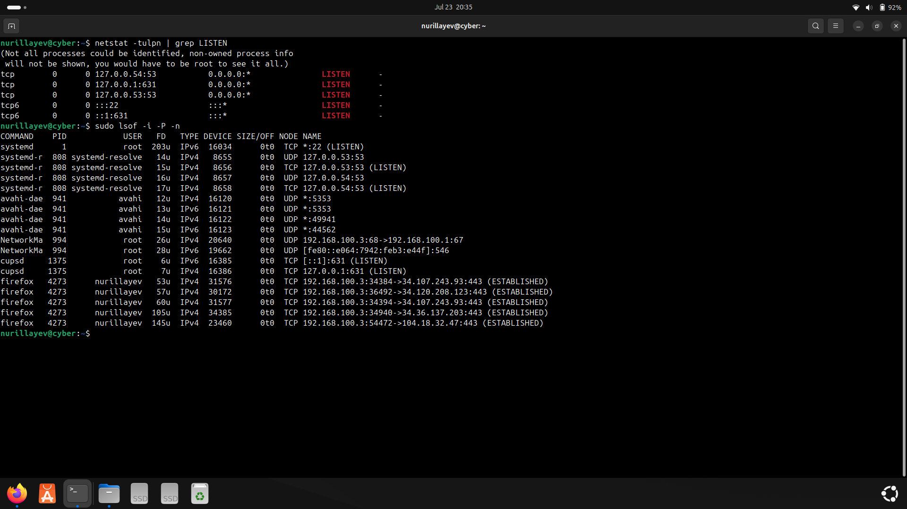
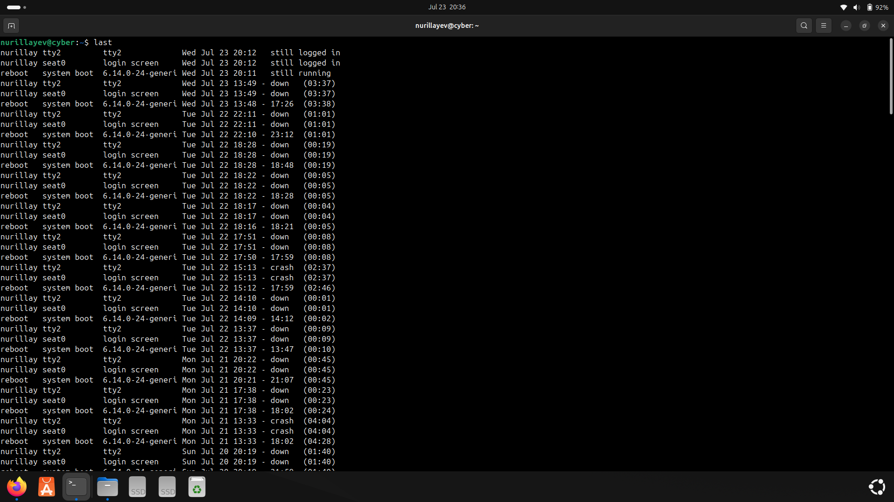
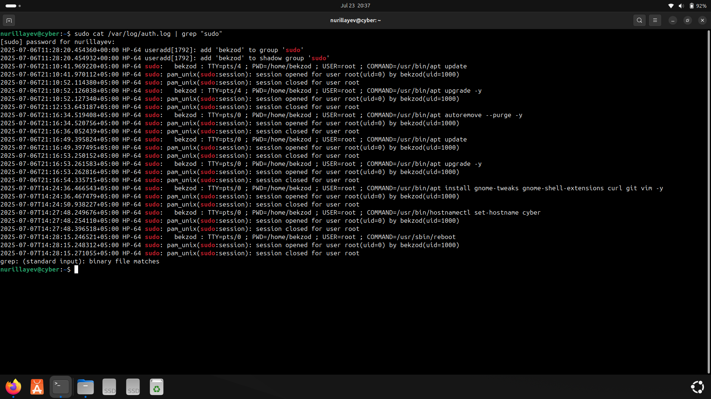
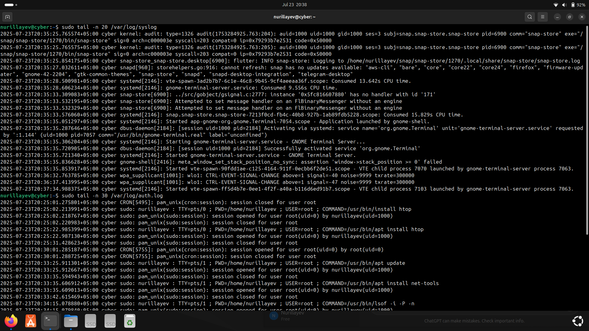
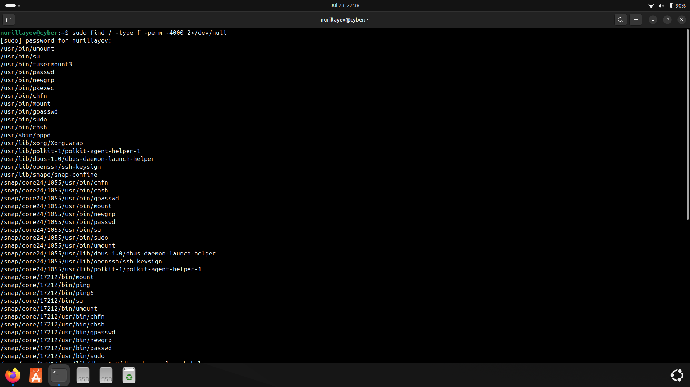
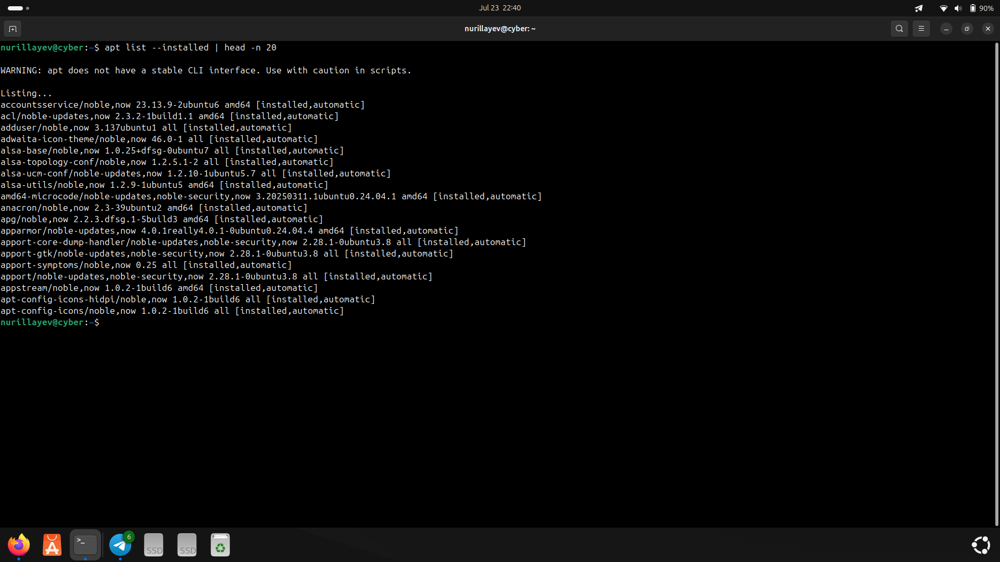

# Day 10 – Final Linux Security Practice and Review

### 🎯 Objective

The purpose of Day 10 was to finalize key Linux security practices and consolidate previously learned skills. This included reviewing critical system information, inspecting running services, identifying potential security risks, and practicing command-line monitoring tools.

---

### 🧰 Commands Used

- `htop` – Interactive process viewer
- `ss -tuln` – List all listening ports and protocols
- `netstat -tulpn | grep LISTEN` – Display listening services and related processes
- `sudo apt install net-tools` – Install legacy networking tools
- `sudo lsof -i -P -n` – Show all open network connections
- `last` – Show user login history
- `sudo cat /var/log/auth.log | grep "sudo"` – Audit sudo command usage
- `sudo tail -n 20 /var/log/syslog` – View last 20 lines of system log
- `sudo tail -n 30 /var/log/auth.log` – View last 30 lines of authentication log
- `sudo find / -type f -perm -4000 2>/dev/null` – Search for SUID binaries
- `sudo find /home -type f -perm -777` – Detect world-writable files
- `dpkg -l | less` – View all installed packages
- `apt list --installed | head -n 20` – Show first 20 installed packages

---

### 🛠️ Practical Tasks

- Monitored active processes and CPU/memory usage using `htop`
- Listed all listening TCP/UDP ports using `ss` and `netstat`
- Viewed open network connections via `lsof`
- Reviewed user login history with `last`
- Inspected recent `sudo` command usage from `auth.log`
- Analyzed recent system logs for suspicious entries
- Detected files with SUID permissions and world-writable permissions
- Listed installed packages for auditing and inventory

---

### 📜 Script

- [`day10_script.sh`](./day10_script.sh): Contains all commands used in Day 10.

---

### 📸 Screenshots

#### 1. Process Monitoring
- Command: `htop`  

#### 2. Open Ports (ss)
- Command: `ss -tuln`  

#### 3. Open Ports (netstat)
- Command: `netstat -tulpn | grep LISTEN`  

#### 4. Login History
- Command: `last`  

#### 5. Sudo Usage Audit
- Command: `sudo cat /var/log/auth.log | grep "sudo"`  

#### 6. System Log Analysis
- Command: `sudo tail -n 20 /var/log/syslog`  

#### 7. SUID Files Search
- Command: `sudo find / -type f -perm -4000 2>/dev/null`  

#### 8. Installed Packages
- Command: `apt list --installed | head -n 20`  

---

### ✅ Status

All review tasks were completed successfully, concluding the core phase of local Linux system security practices.

